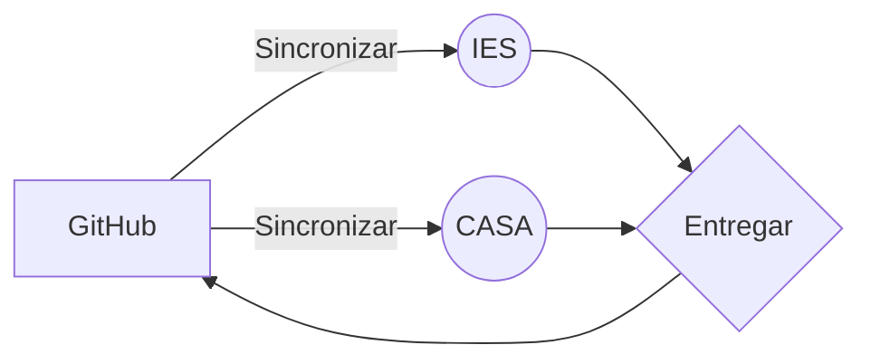

# IES Valle del Jerte - Plasencia
## LMSGI
Esquema resumen entrega de prácticas

```mermaid
graph LR
A[GitHub] -- Sincronizar --> B((IES))
A -- Sincronizar --> C((CASA))
B --> D{Entregar}
C --> D
D --> A
```
Ejemplo de fórmulas de Markdown

$$
 x = \frac {-b \pm \sqrt {b^2 - 4ac}}{2a}
$$