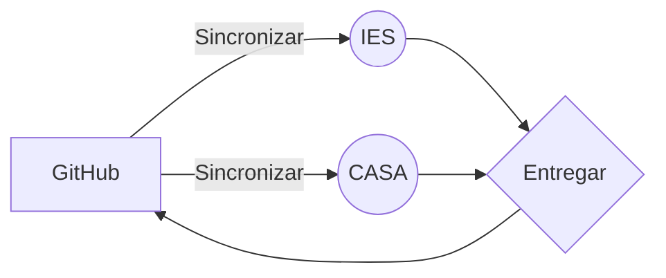

# IES Valle del Jerte - Plasencia
## LMSGI
Esquema resumen entrega de prácticas

Ejemplo de fórmulas de Markdown

$$
 x = \frac {-b \pm \sqrt {b^2 - 4ac}}{2a}
$$

rodrigo dlkñfalsñkfsakl
dafasfasdfafasfasdfsdafs